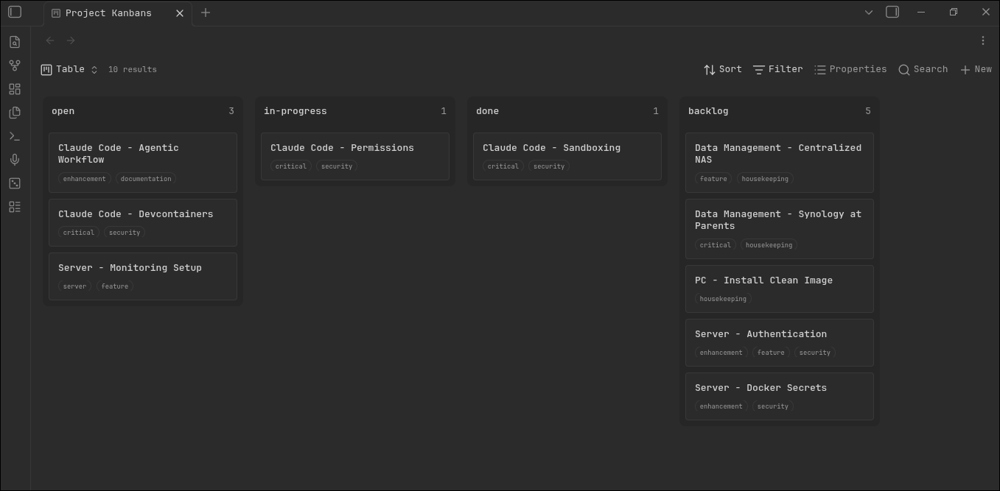

# Obsidian Bases Kanban

A kanban board view for [Bases](https://obsidian.md/help/bases). The board is driven entirely by Bases primitives.


## How Bases maps to kanban

| Bases primitive | Kanban concept | Effect |
|---|---|---|
| **Filter** | Board | Which notes appear on the board |
| **Group by** | Columns | One column per distinct group-by value |
| **Sort** | Card order | Order of cards within each column |
| **Properties** | Card content | Fields shown on each card |

## Usage

1. Create or open a `.base` file
2. Configure **Filter**, **Group by**, **Sort**, and **Properties** using the standard Bases toolbar
3. Switch to the **Kanban** view — the board reflects your configuration immediately
4. Drag cards between columns to update the group-by property; click cards to open notes

## Installation 

As soon the plugin is [merged](https://github.com/obsidianmd/obsidian-releases/pull/12084), you can install using the plugin manager. For now, place the files under `.obsidian/plugins/bases-kanban`

### Example

An example on how I setup my frontmatter:

```yaml
---
project: infrastructure
status: open
summary:
tags:
  - enhancement
  - documentation
---
```

With Bases configured to filter on `where project is infrastructure`, group by `status, Z -> A`, sort by `created time New to old`, and properties active `summary` and `tags` — you get a board with columns like **Backlog**, **In Progress**, and **Done**.




## Requirements

- Obsidian **1.10+** (Bases API)
- No additional dependencies
