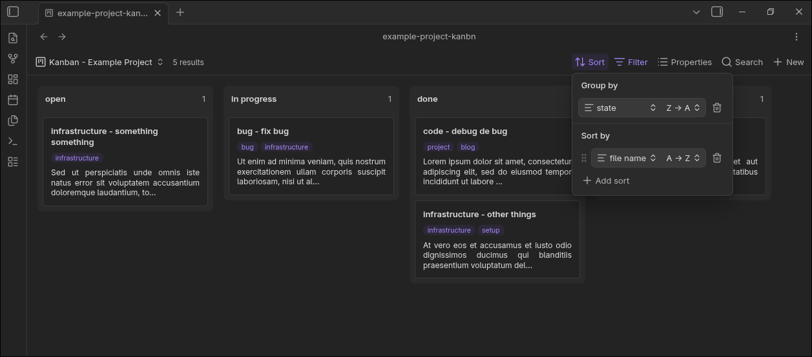

# Obsidian Kanban

A kanban board view for [Bases](https://obsidian.md/help/bases). No extra configuration — the board is driven entirely by your existing Bases setup.



## What it does

- Registers a **Kanban** view type inside Bases
- Renders your Bases query as a kanban board: columns, cards, and drag-and-drop
- Reads and writes standard markdown **frontmatter** — no proprietary format

## How Bases maps to kanban

| Bases primitive | Kanban concept | Effect |
|---|---|---|
| **Filter** | Board | Which notes appear on the board |
| **Group by** | Columns | One column per distinct group-by value |
| **Sort** | Card order | Order of cards within each column |
| **Properties** | Card content | Fields shown on each card |

## Features

### Columns
- One column per distinct value of the group-by property
- Column headers display the group value
- Horizontal scrolling when columns exceed the board width
- Changing the group-by property in the Bases toolbar updates columns live
- When no group-by is configured, the board indicates that grouping is required

### Cards
- Title (filename) always visible
- Configured Bases properties displayed below the title
- Ordered within each column according to the Bases sort configuration
- Changing sort or properties in the toolbar updates cards live

### Uncategorized column
- Cards that match the filter but have no value for the group-by property are collected in an **Uncategorized** column
- Positioned first, before all other columns
- Hidden automatically when no uncategorized cards exist

### Click to open
- Click a card to open the corresponding note in the Obsidian editor
- Ctrl/Cmd+click opens the note in a new tab

### Drag and drop
- Drag a card to a different column to move it
- Dropping updates the group-by property in the file's frontmatter to the target column's value
- The card lands in the position determined by the Bases sort configuration
- Visual feedback during drag; works on desktop and mobile

## Installation

1. Open **Settings → Community plugins → Browse**
2. Search for **Obsidian Kanban** and install
3. Enable the plugin
4. Open a Bases file and switch the view to **Kanban** from the view-type selector in the toolbar

## Usage

1. Create or open a `.base` file
2. Configure **Filter**, **Group by**, **Sort**, and **Properties** using the standard Bases toolbar
3. Switch to the **Kanban** view — the board reflects your configuration immediately
4. Drag cards between columns to update the group-by property; click cards to open notes

### Example frontmatter

```yaml
---
project: my-project
status: In Progress
priority: 1
summary: Implement drag and drop
tags:
  - frontend
  - ux
---
```

With Bases configured to filter on `project = "my-project"`, group by `status`, sort by `priority` descending, and show `summary` and `tags` — you get a board with columns like **Backlog**, **In Progress**, and **Done**.

## Requirements

- Obsidian **1.8+** (Bases API)
- No additional dependencies
